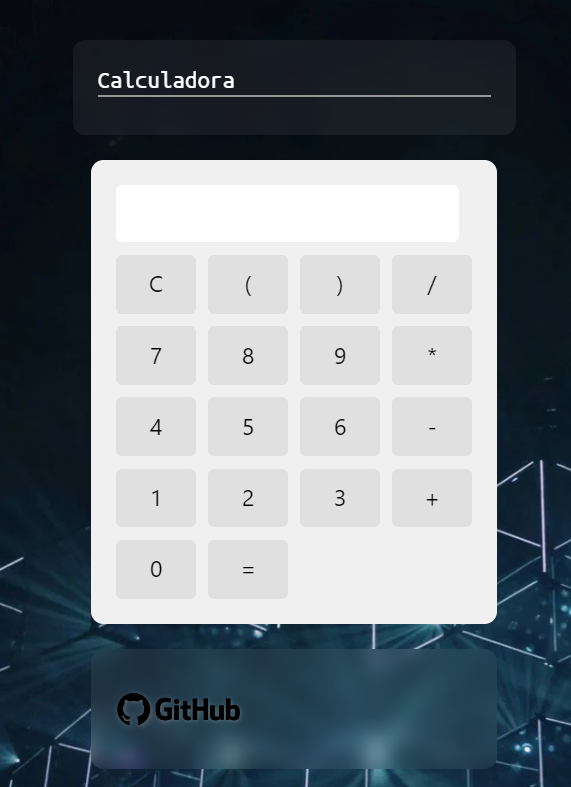

# Calculadora
## Esta es una práctica de javascript realizando una versión de una calculadora con almanque.
### Esto esta realizado con canvas.

Puedes verla en mi Portafolio:[ir](https://leogidev.free.nf/Practicas/calculadora/)

